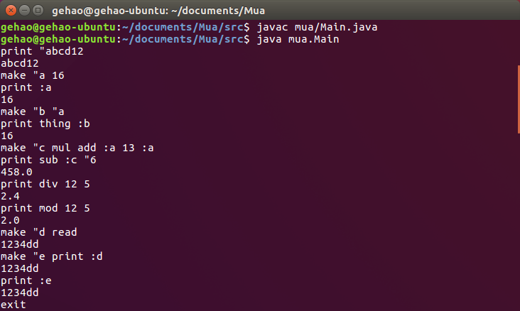

### Mua

> The MakeUp Programming Language based on JAVA.
>
> 用JAVA写的MUA语言解释器，从头开始设计一门新语言.

#### Documents

##### 基本数据类型value

数字number，字word，表list，布尔bool

- 任何值之间都以空格分隔
- 数字的字面量以[0~9]或'-'开头，不区分整数，浮点数
- 字的字面量以双引号"开头，不含空格，采用Unicode编码；在"后的任何内容，直到空格（包括空格、tab和回⻋）为止的字符（不含空格），都是这个字的一部分，包括其中可能有的"和[]等符号
- 表的字面量以方括号[]包含，其中的元素以空格分隔；元素可是任意类型；元素类型可不一致
    - 表的第一个元素和[之间，以及最后一个元素和]之间不需要有空格分隔
    - 表中的字不需要"引导
    - 这是一个有三层表的字面量的例子：[a [b [c d] e]]布尔量只有两个值：true和false
- 数字和布尔量在计算时可以被看作是字的特殊形式，即在字面量和变量中的字，当其中的内容是数字或布尔量时，总是可以根据需要自动被转换成数字或布尔量

##### 名字name

一个以字母开头，只含有字母和数字及下划线的字，可以用做名字，名字区分大小写

##### 基本操作operation

基本形式：操作名参数操作名是一个名字，与参数间以空格分隔；参数可以有多个，多个参数间以空格分隔；每个操作所需的参数数量是确定的，所以不需要括号或语句结束符号；所有的操作都有返回值

一个程序就是操作的序列

基本操作有：

- `make <name> <value>`：将value绑定到name上，绑定后的名字位于当前命名空间，返回value。此文档中的基本操作的名字不能重新命名
- `thing <name>`：返回word所绑定的值
- `:<name>`：与thing相同
- `print <value>`：输出value，返回这个value
- `read`：返回一个从标准输入读取的数字或字
- 运算符operator
    - `add`, `sub`, `mul`, `div`, `mod`：`<operator> <number> <number>`
- `erase <name>`：清除word所绑定的值，返回原绑定的值
- `isname <word>`：返回word是否是一个名字，true/false
- `run <list>`：运行list中的代码，返回list中执行的最后一个op的返回值
- `eq, gt, lt`：`<operator> <number|word> <number|word>`
- `and, or`：`<operator> <bool> <bool>`
- `not`：`not <bool>`

##### 判断

`if <bool> <list1> <list2>`：如果bool为真，则执行list1，否则执行list2。list均可以为空表，返回list1或list2执行后的结果。如果被执行的是空表，返回空表。如果被执行的表只有一项，且非OP，返回该项。

`isnumber <value>`：返回value是否是数字

`isword <value>`：返回value是否是字

`islist <value>`：返回value是否是表

`isbool <value>`：返回value是否是布尔量

`isempty <word|list>`: 返回word或list是否是空

##### 表达式计算

允许使用以下中缀运算符对数字进行计算，实现前缀表达式与中缀表达式的嵌套使用

- 为了方便识别，要求表达式的外面必须有括号()包围，中缀表达式内可以出现前缀OP调用

~~~
+-*/%()
~~~

##### 函数定义和调用

###### 定义

`make <name> [<list1> <list2>]`，其中：

- name为函数名
- list1为参数表
- list2为操作表

以下为函数定义的例子：

~~~
make "prt [  
	[a]  
	[print :a]
]
~~~

###### 调用

`<functionName> <arglist>`，其中：

- `<functionName>`为make中定义的函数名，不需要双引号"
- `<arglist>`是参数表，中的值和函数定义时的中名字进行一一对应绑定
- 以下为函数调用的例子：`prt "hello`

###### 本地变量

- 在函数中访问（读取）变量的值的时候，首先访问本地，如果本地不存在，则访问全局
- 在函数中做make时，永远只写本地：1. 检查本函数内是否存在这个名字，如果存在，则对已有的变量赋值；2. 否，则在本地定义一个新的变量
- 在函数内make出来的函数只在该函数内有效，但是这样的函数并不能访问定义它的函数的本地变量，它的外部仍然直接就是全局变量区

###### 函数相关的操作

- `return <value>`：停止执行函数，设定value为返回给调用者的值
- `export <name>`：将本地`make`的变量`<name>`输出到全局，返回它的值：
    - 如果全局没有这个变量，则增加一个全局变量
    - 如果全局已经有了同名的变量，则替换全局变量的值
    - 在函数内make出来的函数一样可以被export到全部

##### 字表处理

- readlist：返回一个从标准输入读取的一行，构成一个表，行中每个以空格分隔的部分是list的一个元素，元素的类型为字
    - 用readlist读入的只可能是单层的表
- `word <word> <word|number|bool>`：将两个word合并为一个word，第二个值可以是word、number或bool
- `sentence <value1> <value2>`：将value1和value2合并成一个表，两个值的元素并列，value1的在value2的前面
- `list <value1> <value2>`：将两个值合并为一个表，如果值为表，则不打开这个表
- `join <list> <value>`：将value作为list的最后一个元素加入到list中（如果value是表，则整个value成为表的最后一个元素）
- `first <word|list>`：返回word的第一个字符，或list的第一个元素
- `last <word|list>`：返回word的最后一个字符，list的最后一个元素
- `butfirst <word|list>`：返回除第一个元素外剩下的表，或除第一个字符外剩下的字
- `butlast <word|list>`：返回除最后一个元素外剩下的表，或除最后一个字符外剩下的字

##### 数值计算

- `random <number>`：返回[0,number)的一个随机数
- `int <number>`: floor the int
- `sqrt <number>`：返回number的平方根

##### 其他操作

- `save <word>`：保存当前命名空间在word文件中，返回文件名
- `load <word>`：从word文件中装载内容，加入当前命名空间，返回true
- `erall`：清除当前命名空间的全部内容，返回true
- `poall`：返回当前命名空间的全部名字的list

##### 既有名字

系统提供了一些常用的量，或可以由其他操作实现但是常用的操作，作为固有的名字，这些名字是可以被删除（erase）的

- pi：3.14159

#### Preview

- Mua-v1.0

    

    
- Mua-v2.0

    

    
- Mua-v3.0

    - self-define function:

	

    - programming function:

	

	
- Mua-v4.0

    

    

